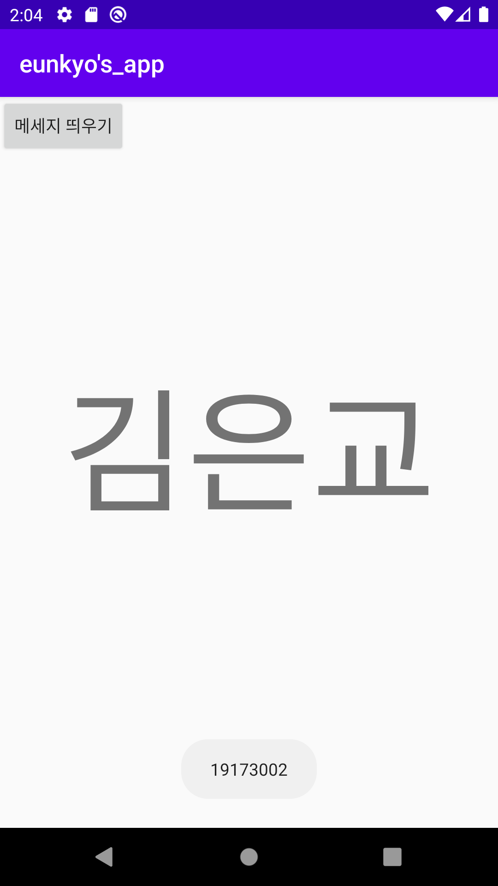
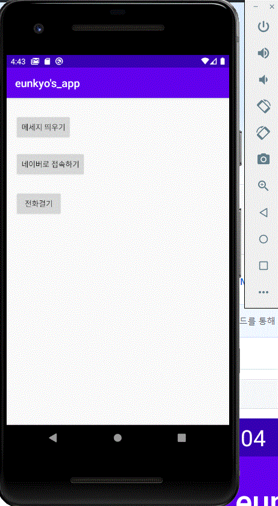
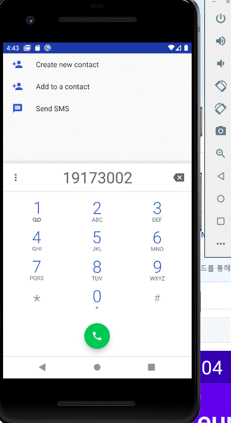

# 19173002 김은교

## 2주차과제

## 3주차과제

## 4주차과제
★개발하고 싶은 앱 
: 라이브 중고경매 어플

★앱 설명 
: 기존의 '중고나라', '번개장터' 와 같은 중고거래 사이트를 사용해보셨다면 아시다 싶히
판매자에게 한명씩 메세지를 남기어서 가격이 어느정도까지 제시가 되었는지, 지금 현재 판매가 완료되었는지 여부에 대해
연락을 드려야 합니다.
판매자의 경우에도 여러 사람에게서 오는 메세지에 하나씩 열람하여 답을 해주어야 하는 수고가 발생하게 되는데

이 어플의 경우, 
판매의 현황을 모두가 볼 수 있도록 판매자는 상품을 설명하는 영상, 혹은 사진 등을 업로드 하면
그 아래로 구매자가 경매를 하며 가격을 제시할 수 있는 시스템으로
하나의 화면에서 여러사람이 제품에 대한 실시간 정보를 확인 할 수 있기 때문에 상호간의 거래 시간이 줄어들게 됩니다.

소비자는 어플에 업로드된 판매자들의 여러가지 경매 제품들을 둘러보며 현 제시 상황, 시가격을 알 수 있으며,
판매자는 정해진 시간까지, 혹은 목표 금액까지 경매 제시가 될 시, 낙찰하여 빠르게 거래를 진행할 수 있습니다.

또한 판매자가 '낙찰' 버튼을 누르게 됨과 동시에 가격제시 댓글이 중지되며 '낙찰'이라는 문구가 뜨게 됩니다.
이로 인해 다른 구매자들은 판매가 되었는지에 대한 여부를 쉽게 파악할 수 있습니다.

## 5주차과제

## 6주차과제

## 7주차과제

